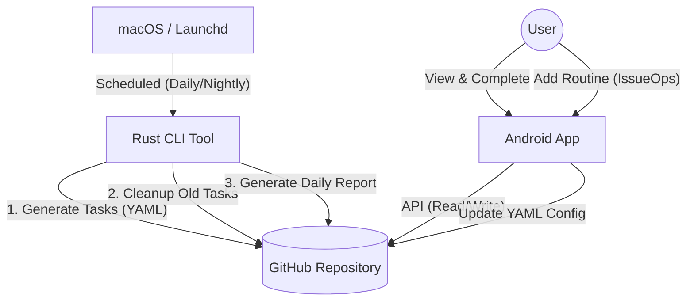
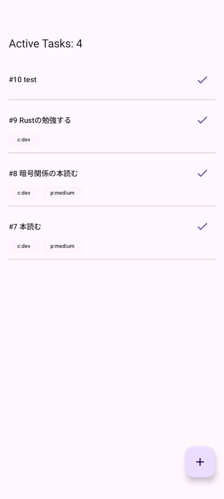
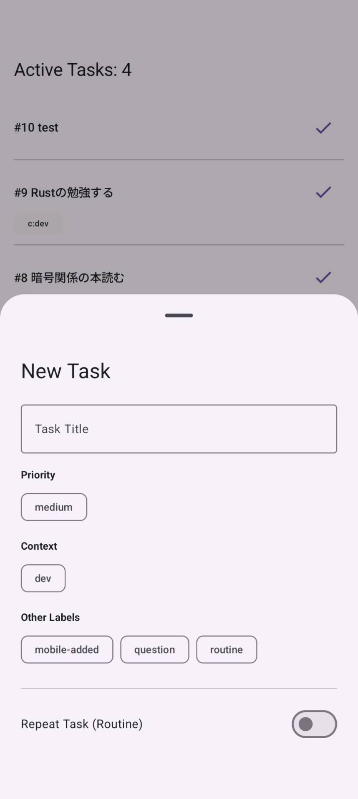

# Personal Task Manager Ecosystem (IssueOps)

**"GitHub Issues as a Database"** 自分自身の生活（My Life）を IssueOps の概念で管理する、完全自作のタスク管理エコシステムです。

Rust製の高速なCLIツールによる自動化、Jetpack Composeを採用したモダンなAndroidアプリ、そしてGitHub APIを駆使したサーバーレス構成により、PC・スマホ・自動バッチがシームレスに連携します。

## 🏗 System Architecture

このシステムは **GitHub Repository** を唯一の「正」となるデータベースとして利用します。



## 🚀 Features

### 1. Backend & Automation (Rust)

Rustで実装されたCLIツール (`task-batch`) が、タスクのライフサイクルを管理します。

* **Task Generator**: `config/routines.yaml` に定義されたスケジュール（`daily`, `weekly:mon,wed`）に基づき、その日のタスクを自動生成します。
* **Auto Cleanup**: 3日以上放置された定期タスクを自動でCloseし、Issuesの肥大化を防ぎます。
* **Daily Report**: その日に完了したタスクを集計し、Markdownレポートとしてリポジトリ内の `reports/` ディレクトリに自動コミットします。
* **Automation**: macOSの `launchd` により、朝のタスク生成と夜のレポート作成が完全自動化されています。

### 2. Mobile Client (Android)

Kotlin + Jetpack Compose で構築されたモダンなモバイルクライアントです。

* **MVVM Architecture**: `Repository` パターンと `ViewModel` による堅牢な設計。
* **IssueOps via UI**: アプリ上のフォームから定期タスクを追加すると、GitHub上の `routines.yaml` を直接書き換え、システム設定を変更できます。
* **Rich UI**:
* Material 3 Design
* Pull-to-Refresh による最新同期
* ラベル（Priority/Context）のフィルタリング選択
* BottomSheet によるスムーズなタスク追加


## 🛠 Tech Stack

| Category | Technology | Usage |
| --- | --- | --- |
| **Language** | **Rust** | Batch CLI Tool, Business Logic |
| **Mobile** | **Kotlin** | Android App Development |
| **UI Framework** | **Jetpack Compose** | Declarative UI, Material 3 |
| **Architecture** | **MVVM** | Android App Architecture |
| **Infrastructure** | **GitHub API** | Database, File Storage, Auth |
| **Automation** | **launchd** | macOS Job Scheduler |
| **Format** | **YAML / Markdown** | Configuration / Reporting |

## 🔧 Setup

### 1. Prerequisites

* GitHub Account & Repository (e.g., `my-life`)
* GitHub Personal Access Token (`repo` scope required)

### 2. Environment Variables (Rust CLI)

`task-batch` ディレクトリ直下に `.env` ファイルを作成し、以下の情報を設定してください。

```bash
# task-batch/.env
GITHUB_TOKEN=ghp_xxxxxxxxxxxxxxxxxxxx
GITHUB_OWNER=YourUserName
GITHUB_REPO=my-life

```

### 3. Android Secrets

Androidアプリ側は `local.properties` に定義を追加します（ビルド時に `BuildConfig` として生成されます）。

```properties
# app/local.properties
GITHUB_TOKEN=ghp_xxxxxxxxxxxxxxxxxxxx
GITHUB_OWNER=YourUserName
GITHUB_REPO=my-life

```

## 🤖 Automation Setup (macOS)

`task-batch/launchd/` に含まれる設定ファイルを使用して、定期処理を自動化します。

### 1. Edit Configuration Files

`task-batch/launchd/` 内の `.plist` ファイルを開き、以下のパスをご自身の環境に合わせて書き換えてください。

* `ProgramArguments`: `task-batch` 実行ファイルへの絶対パス
* `WorkingDirectory`: `task-batch` プロジェクトディレクトリへの絶対パス
* `StandardOutPath` / `StandardErrorPath`: ログ出力先のパス

### 2. Install Launch Agents

編集したファイルを `~/Library/LaunchAgents/` にコピーします。

```bash
cp task-batch/launchd/*.plist ~/Library/LaunchAgents/

```

### 3. Load & Start

`launchctl` コマンドでジョブを登録し、開始します。

```bash
# Generate Task Job (Morning)
launchctl load ~/Library/LaunchAgents/com.yourname.taskmanager.plist
launchctl start com.yourname.taskmanager

# Report & Cleanup Job (Night)
launchctl load ~/Library/LaunchAgents/com.yourname.taskmanager.report.plist
launchctl start com.yourname.taskmanager.report

```

※ 設定を変更した場合は、一度 `unload` してから再度 `load` してください。

## 📂 Directory Structure

```text
.
├── task-batch/           # Rust CLI Project
│   ├── src/
│   │   ├── main.rs       # Batch Logic (Generate, Cleanup, Report)
│   │   └── ...
│   ├── launchd/          # Launchd Configuration Files (.plist)
│   │   ├── com.xxx.taskmanager.plist
│   │   └── com.xxx.taskmanager.report.plist
│   ├── .env              # Secrets (Not committed)
│   └── Cargo.toml
├── mobile-app/                  # Android Project
│   ├── src/main/java/com/example/mobiletaskmanager/
│   │   ├── data/         # Repository & API Definitions
│   │   ├── ui/           # ViewModel & Compose UI
│   │   └── MainActivity.kt
│   ├── local.properties  # Secrets (Not committed)
│   └── build.gradle.kts
└── config/
    └── routines.yaml     # Routine Definitions (Source of Truth)

```

## ⚙️ Configuration (`routines.yaml`)

定期タスクはYAMLファイルで宣言的に管理されます。

```yaml
routines:
  - title: "Rustの勉強をする"
    schedule: "weekly:sat,sun"
    labels: ["c:study", "p:medium"]
    
  - title: "メールチェック"
    schedule: "daily"
    labels: ["c:work", "t:15m"]

```

## 🏷 Label Strategy

タスクの粒度と優先度を明確にするため、以下のプレフィックスルールを採用しています。

* **`p:` (Priority)** - `p:critical`, `p:high`, `p:medium`
* **`c:` (Context)** - `c:dev`, `c:work`, `c:life`, `c:health`
* **`t:` (Time)** - `t:15m`, `t:1h` (所要時間目安)

## 💻 Usage (Manual)

### Rust CLI

```bash
# Generate Daily Tasks
cargo run --release -- generate

# Cleanup Old Tasks
cargo run --release -- cleanup

# Create Daily Report (Push to GitHub)
cargo run --release -- report

```

## 📸 Screenshots

| Task List | Add Task (Bottom Sheet) |
| --- | --- |
|  |  |

---

*Created by Morishita-mm*